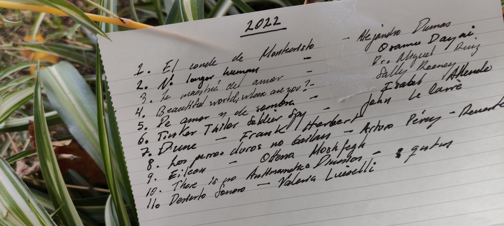

+++
title = "Los mejores libros del 2022"
date = 2022-12-31
+++

Generalmente soy una persona muy reservada en cuanto a mis opiniones, lo cuál es una lástima,
pues tengo muchas de ellas. Mis pasatiempos han cambiado radicalmente en mis veinticinco años de vida.
Afortunadamente mi sano apetito por la lectura sigue tan renovado y vigente como nunca. 

Este año dosmil veintidos leí once modestos libros. No todos valen una mención en esta lista,
pero si uno presta atención aunque sea a la etiqueta del champú, o a las revistas de chismes en la
peluquería, es probable que encuentre un párrafo que lo mueva a las lágrimas. Pienso 
que las personas estamos en el mundo para absorber historias de otras personas; para absorber la belleza
que emana la vida, que a veces es más fácil percibirla como observador externo en vez de la que vivimos 
en carne propia. Los grandes autores tienen la facultad de proveernos de una ventana a través de la
cual no solo vemos los grandes sentimientos universales retratados, sino que lo vuelven una experiencia
placentera. La posibilidad de vivir mil vidas al alcance de tus manos. 

Sin más preámbulo, estos fueron los libros que más disfruté este 2022:

## 1. El Conde de Montecristo

A principios del año me puse como propósito leer más literatura universal. Los grandes clásicos
de la literatura pueden ser intimidantes, hasta que uno se da cuenta de que no tenían televisión
y los libros eran su Netflix. En este contexto, se vuelve mucho más fácil zamparse un ladrillo de
1000 páginas que se lee como una telenovela: intrigas, traiciones y duelos a capa y espada.
Alejandro Dumas es un maestro, y me emociona leer el resto de su obra. 

## 2. Beautiful World, Where are You

El amor en los años 2020 es una bestia compleja. El mundo se cae a pedazos y uno debe de hacer
su lucha por encontrar la autenticidad en un mundo hiperconectado y que demanda tu atención en todo momento.
Sally Rooney se caracteriza por usar las palabras como bisturí en sus historias: ninguna falta,
ninguna sobra. Esa agudeza la pone en práctica para convertirse en la voz de una generación perdida
en una sociedad hostil, en donde toda vulnerabilidad es penada y castigada. ¿Y tu, los mensajes de quién
lees al llegar borracho en la madrugada a tu casa?

## 3. Dune

Usualmente, pierdo el interés en leer un libro una vez que he visto su adaptación en la pantalla
grande. Sin embargo, es difícil ignorar la bestia que se esconde bajo la superficie en Dune. Frank Herbert 
sabe tejer una épica meticulosa, ambiciosa y de una escala inimaginable. Su disciplina y paciencia crean una psicodélica 
historia de grandes intrigas políticas, batallas e inteligencia que dejan satisfecho a los paladares más exigentes. Dune
es literatura en todas sus letras y esconde entre sus páginas posturas políticas que se vuelven aún más impresionantes
al tomar en cuenta que es un libro que se terminó en 1965. Por todo esto y más es que lo considero mi libro favorito
del año.

## 4. Eileen

A veces un libro no necesita ser la gran proeza literaria, ni tocar las fibras más sensibles en tu sentir.
A veces un libro puede solo ser gracioso, explícito y provocar una sensación física para ser memorable.
Justamente eso es lo que hace Eileen.  Sin grandes ambiciones ni pretensiones, Ottessa Moshfegh te toma 
de la mano y te narra una historia altamente entretenida y ocasionalmente vulgar, en donde al final solo alcanzas
a preguntarte "¿Qué carajos acabo de leer?" y te tomas un momento antes de seguir con tu vida. Altamente recomendable.

## 5. No Longer Human

Dudé mucho al incluir este libro en mi lista ya que el leerlo no fue una experiencia placentera. Osamu Dazai describe
con maestría la sensación de imposibilidad de encajar funcionalmente en la sociedad. _"All I feel are the assaults of apprehension and 
terror at the thought that I am the only one who is entirely unlike the rest"_. Sensaciones familiares para todo aquel 
que haya sido un inquilino indeseable en su propia cabeza, incapaz de perdonarse a sí mismo por los errores más inocentes
y los sentimientos más humanos.

Estos fueron los libros que merecen una mención especial este 2022. Nos vemos el próximo año para hacer el recuento de
los libros del 2023 (o tal vez no).

