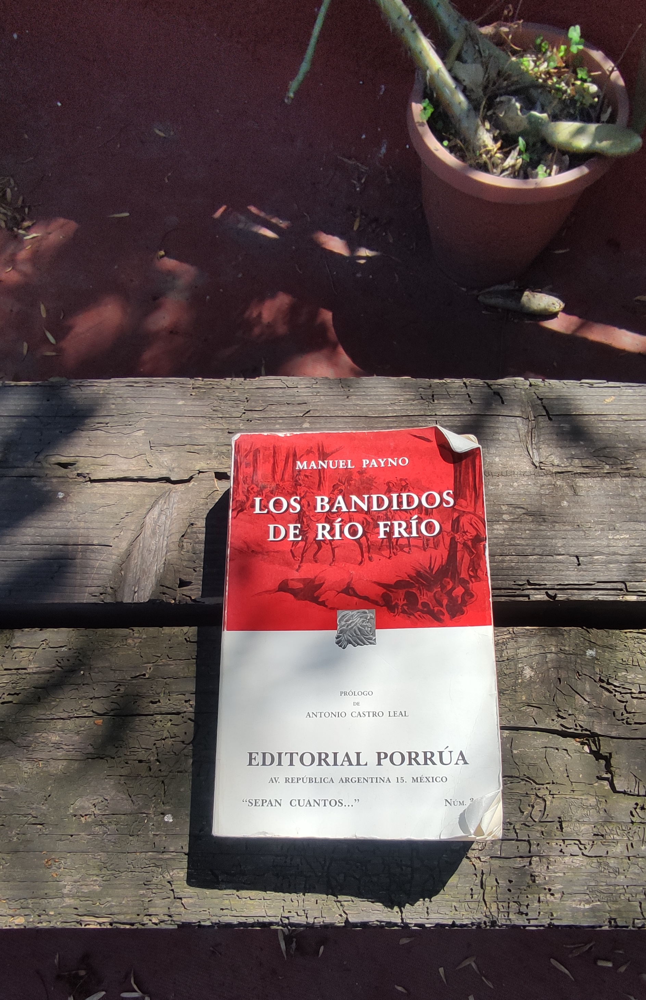

+++
title = "Los bandidos de Río Frío"
date = 2025-02-07 
+++

Los Bandidos de Río Frío es uno de esos libros que mi papá me recomendó toda la vida. Durante más de veinte años,
se mantuvo intacto, acumulando polvo en el librero de la casa, formando parte de esos libros que dan a las visitas la impresión de que la familia es inalcanzablemente culta. 

Es con humildad que he de confesar que por mucho tiempo he sido un lector suceptible a superficialidades: autores de moda y portadas bonitas que pinten bien en mi librero.
Sin embargo, hace poco reconocí que ya estaba "peludo" y tocaba comenzar a leer a los clásicos si tenía la intención de madurar mi gusto por la lectura. Ésto, sumado a la vergüenza
de conocer tan poco de la novela mexicana en general me llevó a la decisión de atacar esta bestia de poco menos de 1000 páginas, laureada como "el estudio costumbrista más amplio que existe
en la literatura mexicana".

He de reconocer que no fue amor a primera vista. Más allá del volumen del libro mismo, somos inmediatamente introducidos a varios personajes, cada uno en diferentes estratos
de la sociedad mexicana del s. XIX. La relación entre ellos no es inmediatamente evidente. La narración pacientemente nos lleva de la mano por las calles de una Ciudad de México
post-independiente, detallando a todo color la riqueza y la variedad de sus habitantes, sus mercados, sus ríos y sus iglesias; es a final de cuentas, una novela costumbrista. 

No obstante, una vez reconocida y aceptada la naturaleza del libro es evidente el valor que este proporciona: una mirada íntima a la idiosincracia del mexicano "a pie". Si bien no hay
respuestas definitivas a una pregunta tan profunda como lo es "¿Por qué somos como somos?", es sumamente interesante darse cuenta de que si bien México como país ha cambiado mucho en
doscientos años, al mismo tiempo poco ha cambiado de las cosas que realmente importan y nos siguen doliendo el día de hoy: el machismo rampante, la relación simbiótica entre gobierno
y crimen organizado, la desensibilización a la violencia y los vestigios clasistas de la colonia española, entre tantas otras cosas. Es en cierta forma catartico poder trazar una línea directa entre las problemas sociales 
de hace casi doscientos años y las heridas abiertas que nos molestan al día de hoy.

Dejando a un lado el análisis de clase de tres pesos por un momento, compararía a Los Bandidos de Río Frío a una mezcla de David Copperfield con El Conde de Montecristo, con 
un poco de melodrama al más puro estilo telenovelesco mexicano contemporaneo. Es un libro que tiene un poco de todo: romance, humor, aventura y crimen. 

Después de casi tres meses desde el día que lo comencé hasta su término, puedo con toda confianza recomendar este libro, del cual podría decir que es más destacable su contenido que su estilo, el cual
sacrifica una voz narrativa estilizada en pos de volver la historia accesible (es una novela de folletín a final de cuentas). Es un libro que no merece ser relegado a estantes polvorientos de librerías de viejo 
y bibliotecas universitarias del cual todos los mexicanos deberíamos, por lo menos, saber de su existencia.
