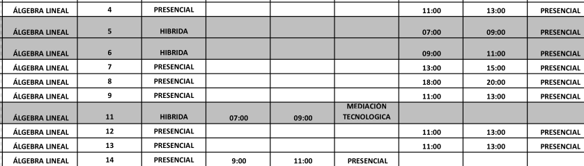
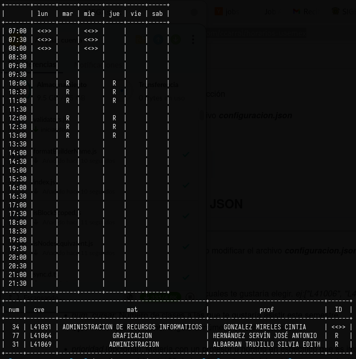
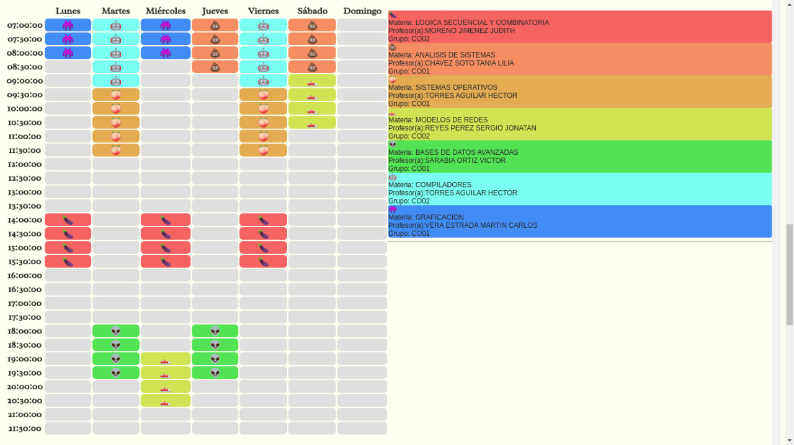
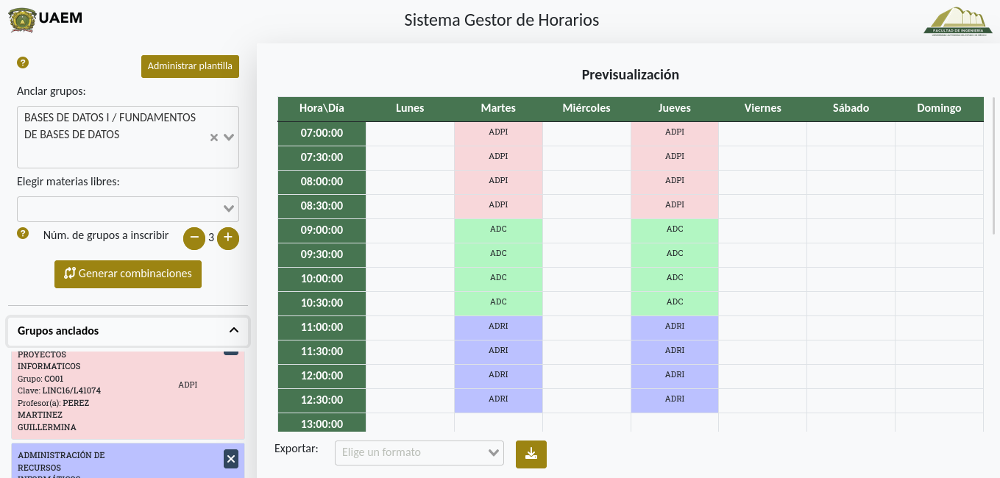

+++
title = "The Schedule Creator"
date = 2022-07-04
+++

This is kind of a long story (but not really). It all started out as a
real problem that required a solution, as most software projects do.

## The problem

My university uses a somewhat antiquated method for managing the way alumni
sign up for classes. Before the semester begins, a list of all available
classes is posted as a PDF somewhere. This PDF has mostly the same format
each semester:

It includes all the relevant information for all available classes:
professor, subject ID, begin and end times for each day. Nothing fancy
really. The problem with this approach is one of scale: most of the time,
there is more than one choice for any given subject, therefore the task of
selecting the appropiate combination of classes to sign up for that meet a
certain student-unique criteria is not a trivial one. Doing this by hand
is an ardous, time consuming task, that sometimes yields less-than-ideal
results.  
If that wasn't enough, there's also the problem of classes
filling up. If you had already settled on a schedule and suddenly one of
the classes of your choice fills up, the process of trial and error must
start all over again. But so is the status quo, and there is nothing we
can do about it. Or is there...?

## The first try

Meet the first [schedule creator](https://github.com/ccarral/horarios-uaemex): a 
crude python script that takes a `config.json` and a `.csv`-transformed
version of the PDF file and yields valid combinations of the subjects of
your choice, with the option of specifying particular classes (say, you
**must** take Calculus 101 with a certain teacher).

It wasn't particularly user friendly nor scalable. It has many flaws that
any developer worth its salt will immediately detect. Nevertheless,
**it worked**, and I made it in a week. I was so excited, as it was the
first time something I built had any real-world use cases. I posted it on
my university social media page and called it a day. 

To this day, I still don't know if anyone but me ever used it. Once my
pride had cooled off and I was able to view it more objectively, I
realized it was a nightmare of a product. Its documentation is **obscure**
to say the least. It's only usable if you know what you are doing, and
only by people with a very specific set of skills.

No, I could do better. But I also had to __get__ better, and learn a few
things first.

## Enter Rust + WASM

From the get-go, the browser was my platform of choice. Its ubiquity,
uniformity and inherent accessibility made it a prime
candidate for such a task. However, __how__ am I going to build this
thing?

Even after two years, I don't regret my choice. 
I had no access to a back end in a server somewhere
(because students don't usually have the budget for such things) and my
only choice was to make it a browser-embedded static application. I had
no intention to mingle with Typescript at the moment and what's more: the underlying 
algorithm is brute-forceish and I could use all the performance advantages
I could muster. Rust is a __powerful__ tool, for those who know how to use it, and
its [WASM](https://rustwasm.github.io/) compilation target made it an
ideal candidate for the task. At this point in time, this wasn't my first
rodeo and while it wasn't trivial, the back end wasn't the most difficult
part of the equation. The front end, however did present itself as a
challenge, as I had almost zero knowledge of web development in general.
In the end, Vue was my weapon of choice, and I'm quite satisfied by it.

This was a little bit more usable, as it was completely web enabled. It
did have some drawbacks regarding UX/UI, but its abstraction layers where
nicely divided and the underlying algorithm was refined and thoroughly
tested. 

It did however lack in its mantainability, as the data it depended on to
function varied each semester and had to be updated accordingly (by me,
obviously). Again, not ideal.

## Third time's the charm?

I had the opportunity to improve on the site for a school project, and
who knows? Maybe it could mean the start of something more focused. After
all, the problem it solves is not unique to my school. It did beg the
question I think all underfunded, understaffed open source projects
encounter, which is "_How much of my time and energy am I willing to invest
in this project, long term?_". Anyone can accomplish a sprint of anything.
But how do I make this tool useful in the long term? Without any access
to my school's private data that is (the bureaucracy is a nightmare),
besides the fact that building a whole auth + database powered web
application is __way__ beyond this project's scope. 

Enter the trustworthy `.csv` file format. It's not the prettiest 
solution, but if I leave the _specification_ for a file format
recognizable by the program, I can assure that even if I don't add any new
features to the program in a long while, it will still be usable as long
as this format is respected. It _does_ place a burden on the user's end,
for providing a valid, usable file. But this is exactly the type of task
that is done __once__ and the file is then distributed through the
official channels, making it available for the whole community.  
Hell, any other _organization_ can make use of this program, as long as
the [specification](https://github.com/ccarral/potro-horario-universitario/tree/main#especificaci%C3%B3n-de-los-archivos-csv-admitidos) is respected.

As for the third iteration itself, I was lucky enough to meet a talented
UX/UI developer who pushed me through the loops of modern UI development
(hello there, [@Jackelino](https://github.com/Jackelino)) and managed to
release a modern, intuitive, feature-packed application. Enter v3 of the
schedule creator:

Maybe feature-packed is an overstatement, but it __does__ have an option
for exporting the generated schedule into a PDF file, which is nice. It
isn't perfect, but software never really is.

This final version incorporates everything I learned over the previous
iterations: 

* __It keeps the concerns separate:__ the main engine is imported as an
  [npm package](https://www.npmjs.com/package/uaemex-horarios), with an
  stable API.

* __It doesn't fail silently:__ Making the correctness of the input an
  end-user concern introduces the problem of providing effective feedback
  on the whole process.

* __It tries to be user friendly:__ It is explicitly __not__ a tool by
  engineers, for engineers. It tries to take into account usability and
  the end user's tech literacy.

## What does the future hold?

I wouldn't say I'm completely satisfied, as I hope to make my effort worth
the while and make this tool less obscure and available to more people 
(the problem it solves and its input parameters are somewhat hard to parse
if you aren't intimately involved with the problem as I was for so long).
It would also be nice to be able to introduce allotted, untouchable, free time
slots that the algorithm respects, besides a million tiny things that would make
the user experience so much better. Time will tell.  

If you want to check it out, the final version is available [here](https://sigeho-test-040522.netlify.app) and the
project repository resides on [github](https://github.com/ccarral/potro-horario-universitario). A valid input file can be found
[here](https://ccarral.github.io/files/2022/A/plantilla_ico_2022A.csv).

The source code for the combinatorial, WASM-targeted rust engine library
resides [here](https://github.com/ccarral/schedule-engine). 
